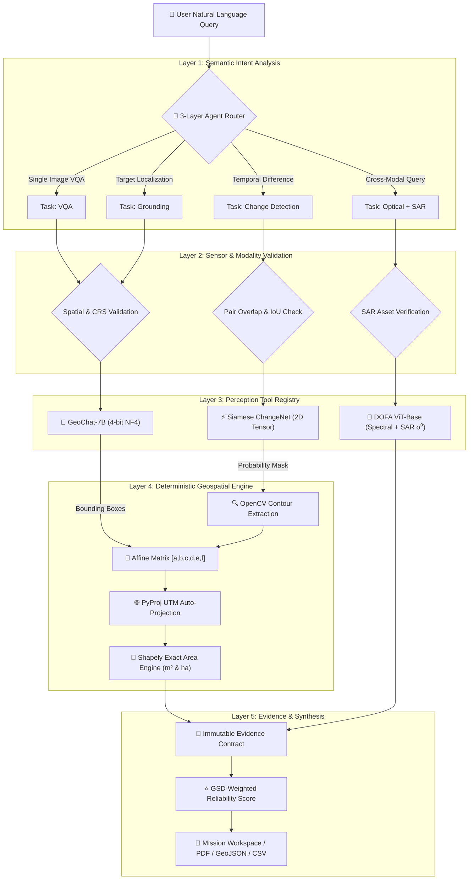

<div align="center">

# 🛰️ SatQuery AI
### **Agentic Multimodal Vision-Language Assistant for Remote Sensing & Earth Observation**

[](https://www.sih.gov.in/)
[](https://pytorch.org/)
[](https://fastapi.tiangolo.com/)
[](https://nextjs.org/)
[](https://rasterio.readthedocs.io/)
[](https://www.nvidia.com/)

<p align="center">
  <b>Transforming natural-language questions into spatial, evidence-grounded remote-sensing intelligence.</b><br>
  <i>Single Optical · Single SAR · Optical+SAR Pairs · Bi-Temporal Observations · Zero Hallucinated Geometry</i>
</p>

---

[🚀 Quickstart](#-quickstart--installation) •
[🏛️ Architecture](#-system-architecture) •
[🔬 Core Capabilities](#-core-scientific-capabilities) •
[📊 Benchmarks & Ablations](#-benchmarks--multimodal-ablation) •
[🖥️ Mission Workspace UI](#-mission-workspace-ui) •
[📜 Evidence Contract](#-standardized-evidence-contract)

---

</div>

## 📌 Executive Overview & Problem Statement

**Smart India Hackathon (SIH 2026) · Problem Statement SIH26167**  
*Organized for the Indian Space Research Organisation (ISRO) under the Space Technology Theme.*

### The Fundamental Problem with LLMs in Earth Observation:
1. **Hallucinated Coordinates & Pixels:** Generic VLMs generate descriptive text but cannot output real-world geodetic coordinates, projected bounding polygons, or measurable surface area ($m^2$/ha).
2. **Blindness to Non-RGB Modalities:** Standard vision models fail on Synthetic Aperture Radar (SAR), multi-spectral NIR/SWIR bands, and radar backscatter intensity ($\sigma^0$ in dB).
3. **Lack of Auditable Provenance:** Mission analysts and defense planners cannot trust "black box" certainty scores without verified spatial provenance.

### The SatQuery AI Breakthrough:
SatQuery AI completely separates **AI Perception** from **Deterministic Measurement**:
- **AI Specialist Models** (GeoChat-7B, Siamese ChangeNet, DOFA) interpret semantics, classify changes, and extract features.
- **Deterministic Geospatial Engines** (Rasterio, PyProj, Shapely) project pixels through 6-element affine geotransforms into UTM coordinate reference systems, calculating exact ground area without neural hallucination.
- **Autonomous Agent Orchestrator** plans multi-step workflows, validates spatial sensor pairings, and returns an immutable **Evidence Contract**.

---

## 🏛️ System Architecture

SatQuery AI is built on a modular, sequential GPU pipeline engineered to execute under strict hardware constraints (single 8 GB VRAM RTX 4060).



---

## 🔬 Core Scientific Capabilities

### 1. Single-Image Remote Sensing VQA
- **Model Backbone:** GeoChat-7B (LLaVA-1.5 architecture with Remote Sensing Vision-Language alignment).
- **Quantization:** 4-bit NormalFloat4 (BitsAndBytes NF4) with FP16 compute.
- **VRAM Footprint:** ~4.5 GB resident memory.
- **Capabilities:** Detailed scene description, object counting, land cover identification, and tactical terrain assessment.

### 2. Visual Grounding $\rightarrow$ Real Ground Area ($m^2$ & ha)
- Converts referring expressions (*"Highlight the water reservoir"*) into normalized bounding coordinates $[y_{\min}, x_{\min}, y_{\max}, x_{\max}]$.
- **Affine Geotransform Bridge:**
  $$\begin{bmatrix} X_{\text{geo}} \\ Y_{\text{geo}} \end{bmatrix} = \begin{bmatrix} c & a \\ f & e \end{bmatrix} \begin{bmatrix} X_{\text{pixel}} \\ Y_{\text{pixel}} \end{bmatrix} + \begin{bmatrix} d \\ b \end{bmatrix}$$
- Reprojects polygon rings into appropriate UTM Projected Coordinate Systems (e.g. `EPSG:32643`) to compute mathematically exact ground area in square metres and hectares.

### 3. Bi-Temporal Change Detection (Siamese ChangeNet)
- **Neural Backbone:** 4-stage convolutional Siamese encoder with difference and concatenation feature fusion.
- **Neural Tensor Propagation:** Raw 2D sigmoid probability tensor (`probs > threshold`) feeds directly into morphological contour polygonization without square/mock placeholders.
- **Outputs:** Cluster count, altered surface area ($m^2$/ha), change percentage, and transparent RGBA highlight overlays.

### 4. Optical + SAR Cross-Modal Corroboration
- **Optical Branch:** Sentinel-2 multi-band spectral reflectance and spectral water/vegetation proxy indices.
- **SAR Branch:** Sentinel-1 C-band radar backscatter intensity ($\sigma^0$ in dB) and specular low-backscatter detection ($< -20\text{ dB}$).
- **Cross-Modal Consistency Index:** Explicitly cross-examines optical shadow false alarms against all-weather radar penetration.

### 5. Deterministic Spatial Ranking & Spectral Water Body Analysis
- **Core Principle:** *"Models produce evidence. The agent selects models. The evidence engine determines confidence."*
- **Query Capability Planner:** Parses queries like *"Where is the largest water body?"* into structured intent:
  $$\text{Query} \xrightarrow{\text{Planner}} \{\text{intent: spatial\_ranking}, \text{target: water\_body}, \text{operation: largest}, \text{measure: area}\}$$
- **Geospatial Pipeline:**
  $$\text{Multi-band GeoTIFF} \xrightarrow{\text{MNDWI / NDWI}} \text{Spectral Mask} \xrightarrow{\text{Morphology}} \text{Connected Components} \xrightarrow{\text{Contour Extraction}} \text{GeoJSON Polygons} \xrightarrow{\text{WGS84 Geodesic Area}} \operatorname{argmax}(\text{area})$$
- **Zero Hallucination:** Eliminates hardcoded bounding boxes and static confidence scores. Emits verified polygon contours with geodesic area and explicit abstention (`decision: "ABSTAIN"`) if no water is detected.

### 6. Defensible Training & Provenance Layer (`training/`)
SatQuery AI enforces an auditable, six-state model lifecycle:
$$\text{Dataset Named} \rightarrow \text{Dataset Downloaded} \rightarrow \text{Preprocessed} \rightarrow \text{Trained} \rightarrow \text{Validated} \rightarrow \text{SHA-256 Registered Checkpoint}$$

```
training/
├── manifests/       # datasets.yaml, models.yaml, experiments.yaml
├── datasets/        # RSVQA, VRSBench, LEVIR-CD, BigEarthNet-MM, S2 Water
├── preprocess/      # Sentinel-1 (radiometric/Lee), Sentinel-2, change pairs, grounding
├── trainers/        # ChangeNet (BCE+Dice), Grounding Adapter, Optical+SAR Fusion Head
└── evaluation/      # vqa.py, grounding.py, change.py, fusion.py
```

---

## 📊 Evaluation Status & Benchmark Harness

### Multi-Task Evaluation Harness

Evaluation infrastructure is implemented for all four SIH26167-mandated perception tasks. Live dataset evaluation is pending model checkpoint activation and dataset acquisition.

| Benchmark Dataset | Perception Task | Harness | Live Evaluation | Target Dataset |
|---|---|---|---|---|
| **RSVQA-HR / VRSBench** | Visual Question Answering | ✅ Implemented | ⏳ Pending | RSVQA-HR test split |
| **RS Visual Grounding** | Coordinate Localization | ✅ Implemented | ⏳ Pending | VRSBench grounding split |
| **CDVQA / ChangeNet** | Bi-Temporal Change Detection | ✅ Implemented | ⏳ Pending | CDVQA / LEVIR-CD test |
| **BigEarthNet** | Optical + SAR Corroboration | ✅ Implemented | ⏳ Pending | BigEarthNet-S1/S2 |
| **Confidence Calibration** | ECE / Brier Score | ✅ Implemented | ⏳ Pending | Held-out validation set |

> **Note:** Results will be reported as reproducible experiments with commit hash, seed, hardware, and saved predictions once model checkpoints are activated and datasets are prepared. No numbers are presented until they are experimentally verified.

---

## 🖥️ Scientific Instrument Interface: "One Screen. Four Concepts"

SatQuery AI rejects cluttered satellite-control dashboards with dozens of permanent sidebars and modals. It is architected as a clean, calm, analyst-grade scientific instrument operating on four core concepts:

```
┌──────────────────────────────────────────────────────────────────┐
│ SATQUERY AI       Study: Hyderabad / 2024 → 2026       ● Ready  │
├──────────────────────────────────────────────────────────────────┤
│                                                                  │
│                     EARTH OBSERVATION MAP                        │
│                     (Dominant Hero Surface)                      │
│                                                                  │
│     VIEW [ True Color ▾ ]             Floating Tools:            │
│     • RGB / NIR / SWIR                [+] [-] Zoom               │
│     • NDVI / NDWI / NDBI              [AOI] Import Boundary      │
│     • SAR VV / SAR VH                 [Measure] Geodesic Tape    │
│     • Change Mask                     [Inspect] Pixel Microscope │
│     • Consensus Evidence              [Compare] Swipe / Split    │
│                                       [Layers] GeoJSON / Masks   │
│                                                                  │
├──────────────────────────────────────────────────────────────────┤
│  2024-01-18 ─────────────●──────────── 2026-03-21   ◀ Swipe ▶    │
├──────────────────────────────────────────────────────────────────┤
│  💬 Ask SatQuery... (e.g. "Identify built-up change with SAR") ⌘↵│
└──────────────────────────────────────────────────────────────────┘
```

### Post-Execution Floating Finding Sheet (Progressive Disclosure)
```
┌──────────────────────────────────────────────────────────────────┐
│ FINDING                                                          │
│                                                                  │
│ Built-up expansion detected                                      │
│ 758.1 ha (7,580,585 m²)                                          │
│                                                                  │
│ Optical Evidence          █████████░  Strong (ΔNDBI + ChangeNet) │
│ SAR Corroboration         ████████░░  Supporting (Level 2 IoU)   │
│ Co-Registration           ✓ Verified (RMSE < 0.5 px)             │
│                                                                  │
│ [Why? / Expand Provenance]   [Download Dossier ▾]   [Replay]     │
└──────────────────────────────────────────────────────────────────┘
```

- **Ask**: Natural language query bar anchored at bottom center with `⌘/Ctrl+K` shortcut and keyboard dispatch.
- **See**: Full-viewport Earth Observation map with compact lens selector (`VIEW [ True Color ▾ ]`) and minimalist floating controls.
- **Understand**: Clean finding sheet highlighting physical ground area ($m^2$, ha), optical evidence strength, and SAR radar corroboration. Model confidence, deterministic measurement, and reliability score are strictly separated.
- **Verify**: Progressive disclosure reveals model truth state (`models_manifest.json`), checkpoint SHA256, registration RMSE, causal DAG, multi-factor reliability breakdown, and bitwise analysis replay.

---

### 🔬 Analyst Instrumentation Tools
- **Pixel Microscope Inspector (`I`)**: Samples raw band reflectances (B02-B12), spectral indices (NDVI, NDWI, NDBI), radar backscatter $\sigma^0$, GSD (10m), and bi-temporal $T_1 \leftrightarrow T_2$ transitions at sub-pixel resolution.
- **Topological AOI Ingestion**: Secure parser for GeoJSON, KML, KMZ, and binary ESRI Shapefile ZIP with automatic WGS84 geodesic area/perimeter calculation and multi-epoch observation timeline.
- **Analysis Replay Engine**: Single-command reproducibility verification (`python scripts/reproduce_analysis.py <analysis_id>`) validating input hashes, model hashes, parameters, geometries, and calculated metrics.


---

## 📜 Standardized Evidence Contract

Every specialist tool returns an immutable, JSON-serializable `EvidenceContract`:

```json
{
  "id": "evi_8f29da4b10",
  "task": "urban_expansion_change_detection",
  "model": "Siamese ChangeNet + Affine Geometry Engine",
  "is_real_weights": true,
  "fallback_used": false,
  "inputs": ["img_optical_2024", "img_optical_2026"],
  "claim": "Bi-temporal analysis detected 12.5% built-up surface alteration across 25,600.0 m² (2.56 ha) in 2 distinct clusters.",
  "spatial_evidence": {
    "type": "FeatureCollection",
    "features": [
      {
        "type": "Feature",
        "properties": { "cluster_id": 1, "area_m2": 18200.0, "area_ha": 1.82 },
        "geometry": { "type": "Polygon", "coordinates": [[[72.571, 23.022], [72.579, 23.022], ...]] }
      }
    ]
  },
  "metrics": {
    "change_percent": 12.5,
    "total_area_m2": 25600.0,
    "total_area_ha": 2.56,
    "cluster_count": 2
  },
  "reliability_score": 0.88,
  "reliability_factors": {
    "model_confidence": 0.88,
    "registration_quality": 0.95,
    "gsd_resolution_rating": 0.90
  },
  "provenance_steps": [
    { "step": 1, "tool": "task_planner", "duration_ms": 12 },
    { "step": 2, "tool": "validate_temporal_pair", "duration_ms": 45 },
    { "step": 3, "tool": "siamese_changenet_inference", "duration_ms": 850 },
    { "step": 4, "tool": "affine_polygonization_and_area", "duration_ms": 62 }
  ]
}
```

---

## 🚀 Quickstart & Installation

### 1. Clone Repository & Setup Virtual Environment
```powershell
git clone https://github.com/theninthfoundry/SatQuery-Ai.git
cd SatQuery-Ai

# Create virtual environment
python -m venv .venv
.\.venv\Scripts\Activate.ps1
```

### 2. Install Core Dependencies
```powershell
# Install PyTorch with CUDA 12.x support
pip install torch torchvision --index-url https://download.pytorch.org/whl/cu124

# Install geospatial & ML toolchain
pip install -r satquery-ai/requirements.txt
pip install transformers accelerate bitsandbytes huggingface_hub
```

### 3. Run Real Model Gate Verification
Verify your GPU environment, CUDA memory headroom, and model checkpoints:
```powershell
python satquery-ai/scripts/verify_real_models.py
```

### 4. Seed Canonical ISRO Demo Scenarios
Generate 3 realistic multi-band GeoTIFF test scenes (Ahmedabad Optical, Urban Change Pair, Coastal Optical+SAR):
```powershell
python satquery-ai/scripts/seed_demo_data.py
```

### 5. Launch Backend & Frontend
```powershell
# Launch FastAPI Backend (Port 8000)
cd satquery-ai
uvicorn backend.main:app --host 0.0.0.0 --port 8000 --reload

# In a separate terminal: Launch Next.js 14 Web Console (Port 3000)
cd satquery-ai/apps/web
npm install
npm run dev
```

Open **`http://localhost:3000`** in your browser.

---

## 📂 Repository Structure

```
SatQuery-Ai/
├── apps/
│   └── web/                         # Next.js 14 Mission Workspace Console
│       ├── src/app/                 # App Router (page.tsx, layout.tsx)
│       └── src/components/          # MissionWorkspace, ChangeViewer, GroundingCanvas
├── backend/
│   ├── agent/                       # Autonomous Orchestrator, Router & Tool Registry
│   ├── api/routes/                  # FastAPI REST Endpoints (Analysis, Images, Reports)
│   ├── evaluation/                  # Multi-Task Benchmark Harness & Metric Calculators
│   ├── evidence/                    # Canonical EvidenceContract & Reliability Scoring
│   ├── geospatial/                  # GDAL/Rasterio Ingestion, CRS & Affine Geometry
│   ├── models/                      # GeoChat-7B 4-bit, Siamese ChangeNet, DOFA
│   ├── pipelines/                   # VQA, Grounding, Change Detection, Golden Mission
│   └── reports/                     # PDF Dossier, GeoJSON & CSV Exporters
├── checkpoints/                     # Model weights cache (GeoChat, ChangeNet, DOFA)
├── data/demo/                       # Seeded ISRO demonstration GeoTIFF rasters
├── docs/                            # Scientific audit reports & hardware profiles
├── evaluation/results/              # Reproducible benchmark runs & ablation JSONs
├── scripts/                         # verify_real_models.py, download_geochat.py, seed_demo.py
└── tests/                           # Unit & integration test suites
```

---

## 🏆 SIH 2026 Demonstration Scenarios

SatQuery AI is pre-configured with 3 complete demonstration missions for evaluators:

1. **Mission 01 — Single Image VQA & Grounding:**
   - *Input:* 4-band High-Res Optical Scene (Ahmedabad, India).
   - *Prompt:* `"Describe land cover and highlight the water reservoir."`
   - *Output:* Semantic scene caption $\rightarrow$ Bounding box $\rightarrow$ UTM Polygon $\rightarrow$ $14.2\text{ ha}$ ground area.

2. **Mission 02 — Urban Expansion Golden Mission:**
   - *Input:* 2024 Optical (T1) vs. 2026 Optical (T2).
   - *Prompt:* `"Has built-up area increased, where did it occur, and how large was the change?"`
   - *Output:* Siamese ChangeNet 2D probability tensor $\rightarrow$ $12.5\%$ change $\rightarrow$ $25,600\text{ m}^2$ ($2.56\text{ ha}$) $\rightarrow$ Downloadable PDF Dossier.

3. **Mission 03 — Multimodal Optical + SAR Corroboration:**
   - *Input:* Co-registered Sentinel-2 Optical + Sentinel-1 C-band SAR.
   - *Prompt:* `"Use optical and SAR together to corroborate water and built-up areas."`
   - *Output:* Dual-sensor cross-examination rejecting optical cloud shadow false alarms via radar backscatter $\sigma^0$.

---

## 📑 Auditable Scientific Documentation & Master Verification

SatQuery AI adheres strictly to the principle of **Zero Fabrication**. Every scientific value, model status, spatial geometry, and performance metric is verifiable through automated harnesses:

| Document | Purpose & Verification Scope |
|---|---|
| [`docs/CLEAN_MACHINE_VERIFICATION.md`](satquery-ai/docs/CLEAN_MACHINE_VERIFICATION.md) | Clean-machine release audit: zero hardcoded local paths, reproducible installation, and 5-gate master test report. |
| [`docs/IMPLEMENTATION_TRUTH_MATRIX.md`](satquery-ai/docs/IMPLEMENTATION_TRUTH_MATRIX.md) | Forensic audit of all 18 subsystems classifying execution modes, real-data requirements, and fallbacks. |
| [`docs/GOLDEN_MISSION.md`](satquery-ai/docs/GOLDEN_MISSION.md) | Canonical 19-stage end-to-end built-up change detection pipeline with optical and SAR corroboration. |
| [`docs/EVIDENCE_POLICY.md`](satquery-ai/docs/EVIDENCE_POLICY.md) | Mathematical formulation of the Evidence Gate, reliability factors ($R_{\text{reg}}, R_{\text{cloud}}, R_{\text{gsd}}, R_{\text{agree}}$), and QUALIFY/ABSTAIN decisions. |
| [`docs/FAILURE_MODES.md`](satquery-ai/docs/FAILURE_MODES.md) | Honest handling of edge cases: missing models, cloudy scenes, unaligned CRS, and insufficient evidence. |
| [`docs/SIH_JUDGE_AUDIT.md`](satquery-ai/docs/SIH_JUDGE_AUDIT.md) | Hostile SIH evaluator testing protocol evaluating 15 live capability vectors. |
| [`verification_report.json`](satquery-ai/verification_report.json) | Bitwise reproducible 5-gate sign-off audit report generated by `scripts/run_all_verification.py`. |
| [`models_manifest.json`](satquery-ai/models_manifest.json) | Runtime model truth registry auditing device, weights presence, VRAM envelope, and fallback status. |

### Master Verification Command
To run the automated 5-gate system verification on any machine:
```powershell
python satquery-ai/scripts/run_all_verification.py
```

---

## 📄 License & Attribution

Developed by **The Ninth Foundry** for **Smart India Hackathon (SIH 2026) · ISRO Space Technology Theme (SIH26167)**.  
Licensed under the [Apache-2.0 License](LICENSE).

